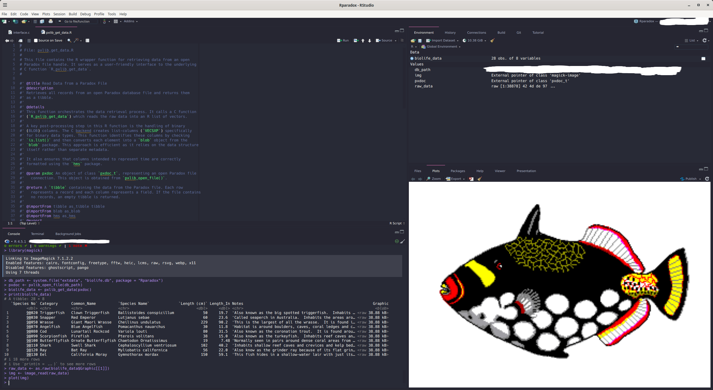

```{r setup, include=FALSE}
knitr::opts_chunk$set(
  collapse = TRUE,
  comment = "#>",
  fig.path = "man/figures/README-",
  out.width = "100%"
)
```
[](https://CRAN.R-project.org/package=Rparadox)
[](https://CRAN.R-project.org/package=Rparadox)
[](https://deepwiki.com/celebithil/Rparadox)

# Rparadox: A Modern Interface for Reading Paradox Databases in R

**Rparadox** provides a simple and efficient way to read data from Paradox database files (`.db`) directly into R as modern `tibble` data frames. It uses the underlying `pxlib` C library to handle the low-level file format details and provides a clean, user-friendly R interface.

This package is designed to "just work" for the most common use case: extracting the full dataset from a Paradox table, including its associated BLOB/memo file (`.mb`).

------------------------------------------------------------------------

## Features

-   **Direct Reading:** Reads Paradox `.db` files without needing database drivers or external software.
-   **Tibble Output:** Returns data in the `tibble` format, which is fully compatible with the Tidyverse ecosystem.
-   **Automatic BLOB Handling:** Automatically detects, attaches, and reads data from associated memo/BLOB (`.mb`) files.
-   **Character Encoding Control:** Automatically handles character encoding conversion to UTF-8 and allows the user to manually override the source encoding for files with incorrect headers.
-   **Type Conversion:** Correctly maps Paradox data types to their corresponding R types, including `Date`, `Time` (`hms`), `Timestamp` (`POSIXct`), `Logical`, `Integer`, `Numeric`, and binary `blob` objects.

------------------------------------------------------------------------

## Installation

```{r, eval=FALSE}
# stable version from CRAN
install.packages("Rparadox")
``` 

You can install the development version of Rparadox from GitHub using the `devtools` package.

```{r, eval=FALSE}
# install.packages("devtools")
devtools::install_github("celebithil/Rparadox")
```

------------------------------------------------------------------------

## Usage

### Basic Usage: The `read_paradox()` function

The easiest way to read a Paradox file is with the high-level `read_paradox()` function. It handles opening the file, reading the data, and closing the connection in a single step.

```{r example}
# 1. Load the package
library(Rparadox)

# 2. Get the path to an example database
db_path <- system.file("extdata", "biolife.db", package = "Rparadox")

# 3. Read the data directly into a tibble
# This automatically finds 'biolife.mb' and handles data types.
biolife_data <- read_paradox(db_path)

# 4. View the data
print(biolife_data)
```



### Handling Incorrect Character Encoding

If you have a legacy file where the encoding is specified incorrectly in the header, you can manually override it using the `encoding` parameter with `read_paradox()`.

```{r, eval=FALSE}
library(Rparadox)
# This tells the package to interpret the source data as CP866
data <- read_paradox("path/to/your/file.db", encoding = "cp866")
```

This ensures that all text fields are correctly converted to UTF-8 in the final `tibble`.

### Advanced Usage

For more control, you can use the lower-level functions. This is useful if you want to inspect metadata before reading the full dataset.

```{r advanced-usage}
library(Rparadox)
db_path <- system.file("extdata", "biolife.db", package = "Rparadox")

# 1. Open the file and get a handle
pxdoc <- pxlib_open_file(db_path)

if (!is.null(pxdoc)) {
  # 2. Get metadata without reading all the data
  metadata <- pxlib_metadata(pxdoc)
  cat("Number of records:", metadata$num_records, "\n")
  
  # 3. Read the actual data
  data_table <- pxlib_get_data(pxdoc)
  
  # 4. Always close the file when you're done
  pxlib_close_file(pxdoc)
}
```

## Links
-   pxlib C library: <https://github.com/steinm/pxlib>
-   CRAN page: <https://cran.r-project.org/package=Rparadox>
-   Bug reports: <https://github.com/celebithil/Rparadox/issues>